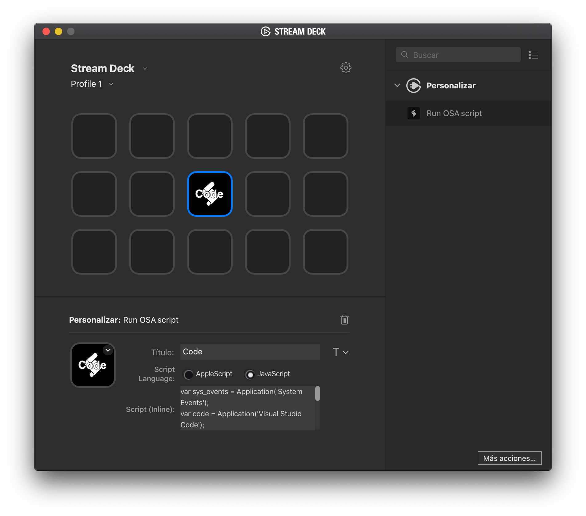

# streamdeck-osascript



## Description

`Run OSA Script` is a plugin that allows you to run arbitrary OSA language scripts (AppleScript and JavaScript for automation). It's based on the plugin `streamdeck-applescript` but this one has been rewritten from the scratch to update it to the Stream Deck SDK v2.

## Features

- code written in Objective-C
- macOS only
- executes AppleScript scripts
- executes JXA (JavaScript for automation) scripts

## Installation

In the Release folder, you can find the file `com.elgato.applemail.streamDeckPlugin`. If you double-click this file on your machine, Stream Deck will install the plugin.

## Source code

The Sources folder contains the source code of the plugin.


## Recipes

### Set VS Code half screen - left

```JavaScript
var code = Application('Visual Studio Code');
var finder = Application('Finder');
var desktop = finder.desktop.window();
var desktopSize = desktop.bounds();

code.activate();

code.windows[0].bounds = {
	x: 0,
	y: 0,
	width: desktopSize.width / 2,
	height: desktopSize.height /2,
};
```

### Set VS Code fullscreen

```JavaScript
var code = Application('Visual Studio Code');
var finder = Application('Finder');
var desktop = finder.desktop.window();
var desktopSize = desktop.bounds();

code.activate();

code.windows[0].bounds = {
	x: 0,
	y: 0,
	width: desktopSize.width,
	height: desktopSize.height,
};
```

## Resources to learn AppleScript and JXA

- [JXA-Cookbook](https://github.com/JXA-Cookbook/JXA-Cookbook)
- [Automating macOS with JXA presentation](https://github.com/josh-/automating-macOS-with-JXA-presentation)
- [Stackoverflow JXA](https://stackoverflow.com/questions/tagged/javascript-automation)
- [Stackoverflow AppleScript](https://stackoverflow.com/questions/tagged/applescript)